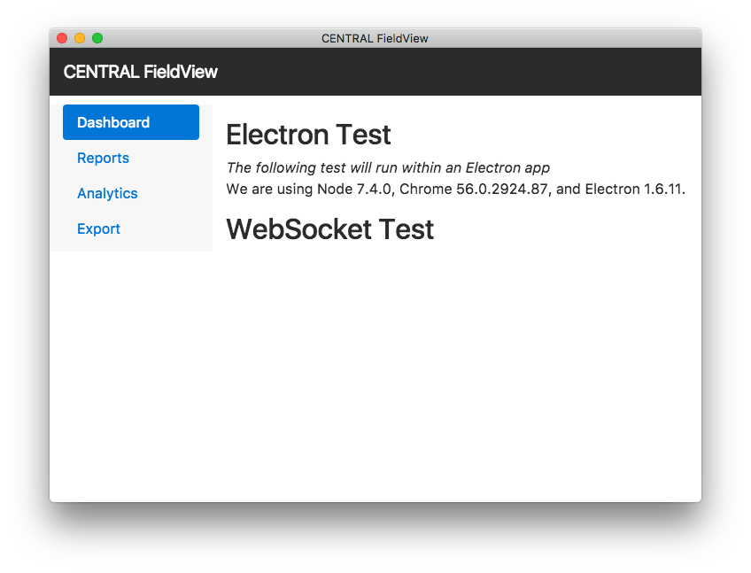

# Week 1

Welcome to Week 1 everyone... it's going to be a fun ride, please provide feedback along the way.

- [Lab 1](lab1/lab1.md) - RPi, SenseHAT, and MQTT Revisited
- [Lab 2](lab2/lab2.md) - Desktop Applications for Visualization with Electron

# Homework

- Show Electron app working with a screenshot showing Node version, Chrome version, and Electron version.

- Send a different payload, on a different channel from the RPi examples we recapped. Show via logs or screenshot.