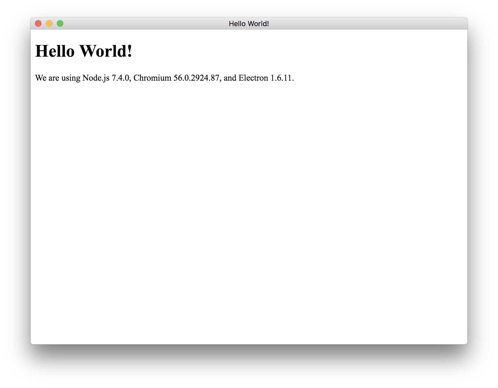
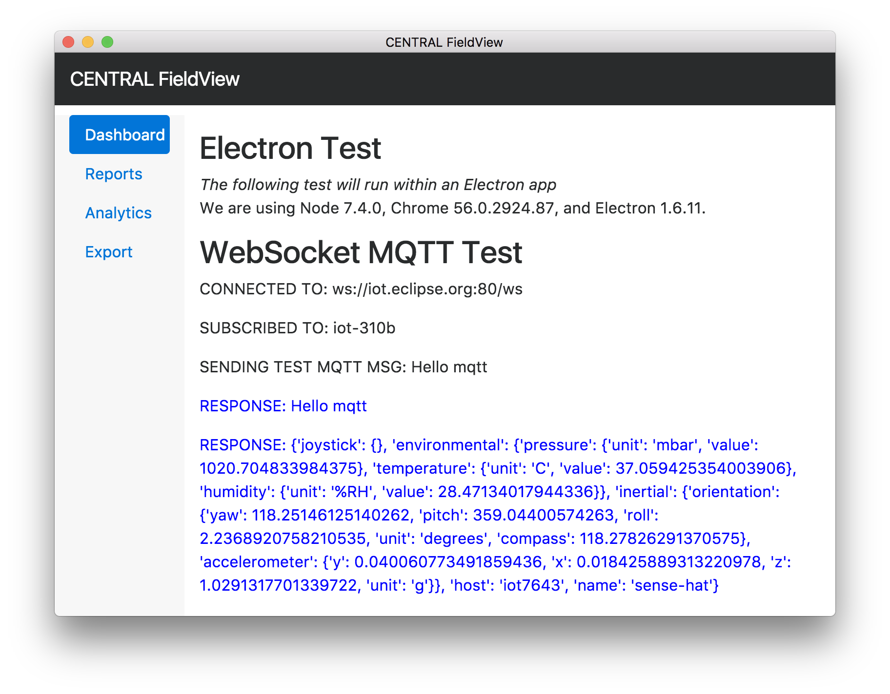

# Lab 2 - Desktop Applications for Visualization with Electron

## Use Case

City field reps require a desktop maintenance app to evaluate assets (sensor) functionality.

## Objectives 

- Learn the basics of Electron
  - Test out a demo app
  - Setup a starer project
- Have an editable dashboard Electron app that you can modify to your needs - codenamed **CENTRAL FieldView** for our class.

## Requirements

- Windows, Mac, or Linux machine

## Lab Links

- [Bootstrap 4 alpha](https://v4-alpha.getbootstrap.com/)
  - CSS framework used for styling
  - Installed via an [bootstrap npm module](https://github.com/twbs/bootstrap) within `package.json`
  - [Bootstrap Dashboard template](https://v4-alpha.getbootstrap.com/examples/dashboard/)
    - Click file **Save As > Web Page Complete** within your browser  to save HTML file with corresponding CSS links remove styling/presentation to liking.
  - [More boostrap starter examples](https://v4-alpha.getbootstrap.com/examples/)
- [Electron](https://electron.atom.io/)
  - Quick start guide can be found on home page
- [Node](https://nodejs.org/en/)
- [NPM](https://www.npmjs.com/)
- [MQTT npm module](https://github.com/mqttjs/MQTT.js)
- [WebSockets](https://en.wikipedia.org/wiki/WebSocket)

## What is NPM?

`npm` makes it easy for JavaScript developers to share and reuse code. We will be using `npm` (Node.js Package Manager) to assist us in downloading packages our applications we need. Additionally, NPM has a ton of reusable Node.js modules and libraries we can use. 

If you’re familiar with any package manager “npm” works in a similar way (e.g. `apt` on Ubuntu Linux) . GUI versions of this are  Apple’s App Store, Microsoft’s Windows Store, and Google’s Play store -- they all download other packages not on your computer and install any dependencies that the package may require may have.

To get a high-level understanding of what NPM is doing for you with regards to package managing, watch the video on this link: 
- [https://docs.npmjs.com/getting-started/what-is-npm](https://docs.npmjs.com/getting-started/what-is-npm)

If you'd like to dive deeper (optional), here is a link that explains more on NPM:
- [https://www.sitepoint.com/beginners-guide-node-package-manager/](https://www.sitepoint.com/beginners-guide-node-package-manager/)


## Electron Overview

Electron enables you to create desktop applications with web technologies you know! HTML/CSS/JS! There is also a rich set of operating system APIs you can use (which we won't cover now). Electron uses Node.js runtime for the backend and Chromium for the frontend.

### Anatomy of an Electron app

An Electron app reflects a folder structure similar to a NodeJS application structure. If you don't have direct experience with that, no worries -- let's break it down.

**Example project structure**

```text
your-app/
├── package.json
├── main.js
└── index.html
```

**Example `package.json`**

```json
{
  "name"    : "your-app",
  "version" : "0.1.0",
  "main"    : "main.js"
}
```

The file that describes all the required dependecies/packages needed to run/install the Electron app are within `package.json`. 

There is a default `main.js` that will load the `index.html` file as well. These two files will recieve the bulk of the updates/edits.


## Electron Demo App

### Download Electron Demos

Before you go down the process of working with Electron, it's best to see a final product. *Visual Studio Code*, *Atom* and *Slack* are popular desktop application  examples created using Electron (*Fun Fact: GitHub was originally called Atom Shell, used to build out Atom*).

Download the [Electron Demos App](https://github.com/electron/electron-api-demos/releases) to get a feel for what Electron can do (it shows off native OS API calls too!). Download the latest version (1.3.0 at time of writing) for your OS.

## Electron Quick Start app

Everything related to this guide is from the perspective of a field worker who has as laptop (we will use `$host` as an indicator) with internet connection. So run this on your laptop, not on the RPi.

### Install NodeJS

Follow the instructions at [https://nodejs.org/](https://nodejs.org/) to install Node.js (please install the **Current** release, v8.1.2 at time of writing). Downloads are available for Windows, Mac, and Linux.

Installing Node.js will also give you a package manager called `npm`.

Verify Successful Installation using the following commands:

```bash
host$ node --version
# v8.1.2
host$ npm --version
# v5.0.3
```

### Setup the Electron Quick Start app

This is verbatim from the [Electon Quick start](https://github.com/electron/electron-quick-start) website. It's a simple easy way to setup a minimal Electron app with file defaults, recommended folder structure, and preconfigured settings.

```bash
# Clone the Quick Start repository
host$ git clone https://github.com/electron/electron-quick-start

# Go into the repository
host$ cd electron-quick-start

# Install the dependencies and run
host$ npm install && npm start
```

A window should popup (your Electron app) and it should say "Hello, World!"

The command `npm start` is calling the following area of the file `package.json`. The value of `start` is `electron .`, so npm will fire that command on the terminal as if you wrote it.

```javascript
...

"scripts": {
    "start": "electron ."
  },

...
```

**Example Electron Starter App screenshot**




## Setup CENTRAL FieldView app

For the purposes on this class, I've included all the necessary items from the git repo of [Electon Quick start](https://github.com/electron/electron-quick-start) so it's easier to work with to start *(e.g. Bootstrap 4 has already been added to the package list)*. Feel free to download the quick start in a separate folder so you can see what it contains and how it was mixed together for our purposes.

### MQTT npm module

To communicate over MQTT on the web we're going to use [WebSockets](https://en.wikipedia.org/wiki/WebSocket), specifically we going to send MQTT over WebSockets. Instead of creating and writing this from scratch, someone has already graciously created a library that just this.

The [MQTT npm module](https://github.com/mqttjs/MQTT.js) allows us to communicate on MQTT over WebSockets. This is our first `npm` module. The `mqtt` npm module (i.e package)  is a library that someone wrote and uploaded to the npm registry (place where you can download npm modules. When you call `npm install [package]` it finds that package and downloads it to a folder called `node_modules`. 

This package/dependency is defined within the `package.json` file. This was added to the `package.json`  file using the command `npm install mqtt`.

```javascript
...

"dependencies": {
    "bootstrap": "^4.0.0-alpha.6",
    "mqtt": "^2.9.0"
  },

...
```

#### MQTT over WebSockets

Open the file `centralView.html` within a text editor and notice that we are connecting to the MQTT server over WebSockets (another application layer protocol in the same vien as HTTP)! WebSockets will allow us to multiplex requests/responses to another server and keep a long lasting connection open. Most modern MQTT brokers provide WebSockets support.

**Example of MQTT broker url from `centralView.html`**

```javascript
var wsMQTTConnectionString = "ws://iot.eclipse.org:80/ws"
```

Also notice which MQTT topic we are subscribing to (**Note**: This will help in homework)

```javascript
var topic = 'iot-310b'
```

#### Install packages

Make sure you are within the **week1/lab2** folder as `npm` creates a folder called `node_modules` where it stores all the binaries for the packages installed. All packages to be installed are listed under `package.json`.

**Note**: Guide assumes you have already cloned this repo.

```bash
# Install dependencies
~host/week1/lab2:$ npm install
# Install electron globally
~host/week1/lab2:$ npm install electron -g
```

#### Run Electron app

Start the Electron app with:

```bash
~/host/week1/lab2:$ npm start
```

The previous command will start the Electron app. To see what's happening go to the file `package.json`.

Electron will first try to execute whatever value is set for `"main"` (typically `main.js`). If a value isn't provided, it will attempt to load `index.js`. 

If you review the `main.js` file, you can notice where the `centralView.html` webpage is being called and loaded.

```javascript
...

 // and load the index.html of the app.
  mainWindow.loadURL(url.format({
    pathname: path.join(__dirname, 'centralView.html'),
    protocol: 'file:',
    slashes: true
  }))
...

```

**Tips**:
- To exit the Electron app, go to the Electron File Menu and select "Electron" and "Quit/Exit".
- Edit HTML/CSS/JS files and hit the refresh shortcut on your computer to see it reflected within the app.

#### Verify CENTRAL FieldView app is receiving incoming MQTT message

The app is configures to listen on `iot-310b` topic. You should see messages coming through (provided messages are sending through).



## HACKER EDITION: App Distribution

**Note**: Hacker Edition assignments are optional, don't count for anything but give you a starting point for where you should head next. If you'd like to use this in a professional setting.

Package your Electron app for distribution!!!
[https://github.com/electron/electron/blob/master/docs/tutorial/application-distribution.md](https://github.com/electron/electron/blob/master/docs/tutorial/application-distribution.md)