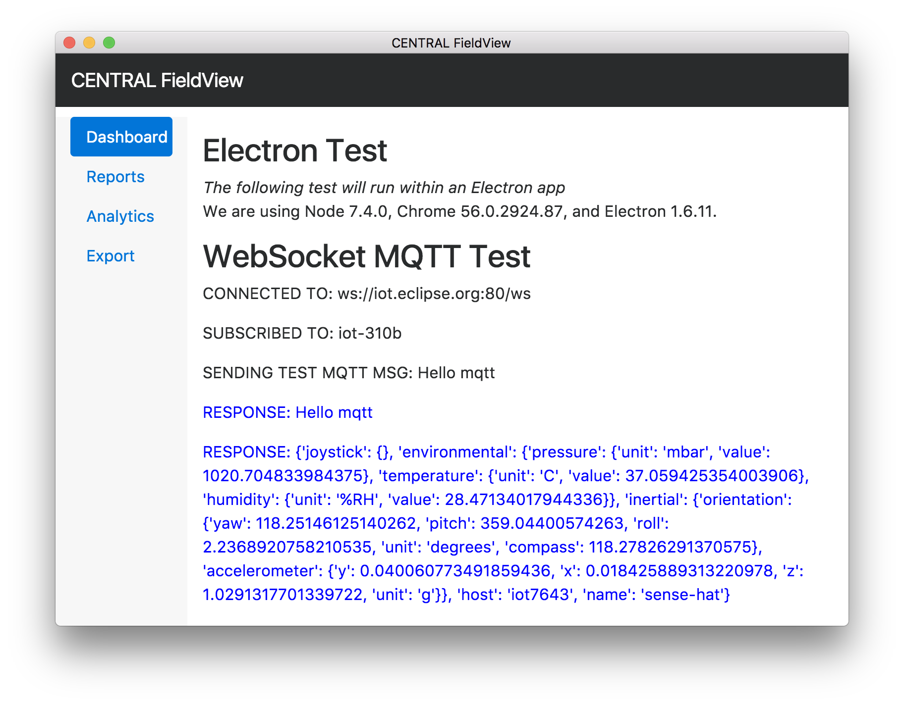

# Lab 2 - Desktop Applications for Visualization with Electron

## Overview

Electron enables you to create desktop applications with web technologies you know! HTML/CSS/JS! There is also a rich set of operating system APIs you can use (which we won't cover now). Electron uses Node.js runtime for the backend and Chromium for the frontend.

- Learn how to build/edit an Electron app.
- Have an editable Electron app that you can modify to your needs.

## Use Case

City field reps require a desktop maintenance app to evaluate assets (sensor) functionality.

### Requirements

- Windows, Mac, or Linux machine

### Download Electron Demos

Before you go down the process of working with Electron, it's best to see a final product. *Visual Studio Code*, *Atom* and *Slack* are popular desktop application  examples created using Electron (*Fun Fact: GitHub was originally called Atom Shell, used to build out Atom*).

Download the [Electron Demos App](https://github.com/electron/electron-api-demos/releases) to get a feel for what Electron can do (it shows off native OS API calls too!). Download the latest version (1.3.0 at time of writing) for your OS.

### Anatomy of an Electron app

An Electron app reflects a folder structure similar to a NodeJS application structure. If you don't have direct experience with that, no worries -- let's break it down.

**Example project structure**

```text
your-app/
├── package.json
├── main.js
└── index.html
```

**Example `package.json`**

```json
{
  "name"    : "your-app",
  "version" : "0.1.0",
  "main"    : "main.js"
}
```

The file that describes all the required dependecies/packages needed to run/install  the Electron app are within `package.json`. 

There is a default `main.js` that will load the `index.html` file as well. These two files will recieve the bulk of the updates/edits.

## Guide

**Note**: Everything related to this guide is from the perspective of a field worker who has as laptop with internet connection. So run this on your laptop, not on the RPi.

#### Install NodeJS

Follow the instructions at [https://nodejs.org/](https://nodejs.org/) to install Node.js (please install the **Current** release, v8.1.2 at time of writing). Downloads are available for Windows, Mac, and Linux.

Installing Node.js will also give you a package manager called `npm`.

**Verify Successful Installation**

*Note*: Stable or latest real

```bash
host$ node --version
# v8.1.2
host$ npm --version
# v5.0.3
```

#### Install packages

**Note**: For the purposes on this class, I've included all the necessary items from the git repo of [Electon Quick start](https://github.com/electron/electron-quick-start) so it's easier to work with to start *(e.g. Bootstrap 4 has already been added to the package list)*. Feel free to download the quick start in a separate folder so you can see what it contains and how it was mixed together for our purposes.

Make sure you are within the **week1/lab2** folder as `npm` creates a folder called `node_modules` where it stores all the binaries for the packages installed. All packages to be installed are listed under `package.json`.

```bash
# Install dependencies
~host/week1/lab2:$ npm install
# Install electron globally
~host/week1/lab2:$ npm install electron -g
```

#### MQTT over WebSockets

Notice that we are connecting to the MQTT server over WebSockets! We have to find a way to do MQTT and keep a constant connection, so WebSockets is a perfect solution for this. Most modern MQTT brokers provide WebSockets support.

**Example of MQTT broker url from `centralView.html`**

```javascript
var wsMQTTConnectionString = "ws://iot.eclipse.org:80/ws"
```

Also notice how we are subscribing (**Note**: This will help in homework)

```javascript
var topic = 'iot-310b'
```

#### Run Electron app

Electron will first try to execute whatever value is set for `"main"` (typically `main.js`). If a value isn't provided, it will attempt to load `index.js`. 

```bash
# Run electron (alternatively you can run use "npm start")
~/host/week1/lab2:$ electron .
```

If you review the `main.js` file, you can notice where the `centralView.html` webpage is being called and loaded.

```javascript
...

 // and load the index.html of the app.
  mainWindow.loadURL(url.format({
    pathname: path.join(__dirname, 'centralView.html'),
    protocol: 'file:',
    slashes: true
  }))
...

```

**Tips**:
- To exit the Electron app, go to the Electron File Menu and select "Electron" and "Quit/Exit".
- Edit HTML/CSS/JS files and hit the refresh shortcut on your computer to see it reflected within the app.

#### Verify you see incoming MQTT message

The app is configures to listen on `iot-310b` topic. You should see messages coming through (provided messages are sending through).



## HACKER EDITION: App Distribution

**Note**: Hacker Edition assignments are optional, don't count for anything but give you a starting point for where you should head next. If you'd like to use this in a professional setting.

Package your Electron app for distribution!!!
[https://github.com/electron/electron/blob/master/docs/tutorial/application-distribution.md](https://github.com/electron/electron/blob/master/docs/tutorial/application-distribution.md)