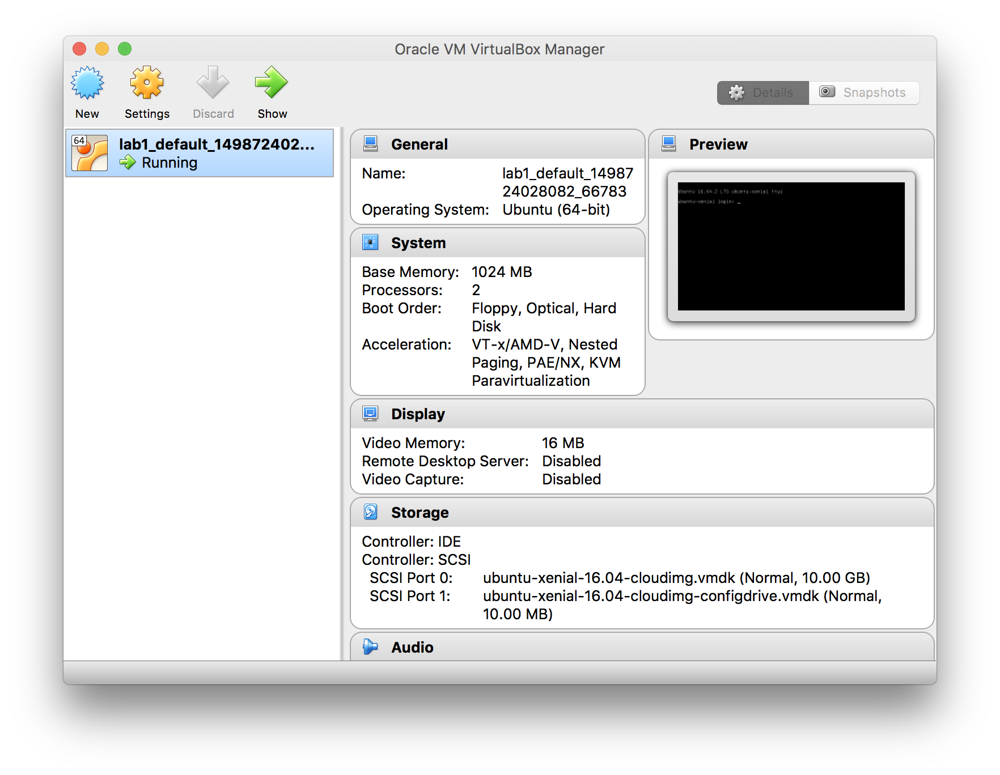

# Intro to Virtual Machines

**Note**: To expedite speed of downloading the base Virtual Machine, run the following command now (after installing Vagrant from [https://www.vagrantup.com/downloads.html](https://www.vagrantup.com/downloads.html))

```bash
host$: vagrant box add ubuntu/xenial64
```

## Overview

This lab will help you get oriented with virtual machines using Vagrant to drive Virtualbox VMs that will ultimately run Ubuntu. We will be able to access the VM directly from terminal and control it. 

Virtual machines are a critical piece to modern cloud infrastructure, in these labs we'll be doing this all locally.

If you've ever setup a Virtual Machine before on your machine, you know that the process goes like this:

1. Download a hypervisor (e.g. VirtualBox, VMWare)
2. Download an ISO of your preferred OS (e.g. Ubuntu/CentOS) to virtualize.
3. Mount the ISO.
4. Walk through the OS installation process.
5. Have a new virtualized OS to do development on.
6. Install packages and system dependecies that your app needs.
7. Launch app and ensure everything is configured properly.
8. Completely forget everything you did on the VM and now never want to destroy it or mess too much with it because you're afraid it'll get into a bad state.
9. To prevent bad states, you snapshot the hell out of it.
10. You now move around a giant VM and all the baggage that it carries (e.g. large disk space, config files, etc)

This results in a "pet" and not "cattle" -- I'll explain this shortly. A  "pet" that you currently have today is your Raspberry Pi. If I told you to flash the SD card with another OS, some of you would be hesitant. Rightfully so, you've spent all this time configuring it, setting it up, and getting it "just right".

"In the old way of doing things, we treat our servers like pets, for example Bob the mail server. If Bob goes down, it’s all hands on deck. The CEO can’t get his email and it’s the end of the world. In the new way, servers are numbered, like cattle in a herd. For example, www001 to www100. When one server goes down, it’s taken out back, shot, and replaced on the line." -- Randy Bias, [The History of Pets vs Cattle](http://cloudscaling.com/blog/cloud-computing/the-history-of-pets-vs-cattle/)

Today, we're going to make some cattle.

## Lab Links

- [VirtualBox](https://www.virtualbox.org/wiki/Downloads)
- [Vagrant](https://www.vagrantup.com)
    - [Docs](https://www.vagrantup.com/docs/index.html)
    - [Boxes](https://app.vagrantup.com/boxes/search)
        - A registry where people upload VMs that have already have a "base" image. An example of a "base" image is downloading an Ubuntu box which already has Ubuntu installed and configured (as well as loading your Vagrant ssh keys).
    - [Provisioners](https://www.vagrantup.com/docs/provisioning/basic_usage.html)
        - Provisioners allow you use to a configuration management tool of your choice (e.g. Chef, Ansible, Puppet, etc) for provisioning a VM. We will not go too deep into this and will use only the shell scripting via Bash.
- [Ubuntu](https://www.ubuntu.com/)
    - We will use Ubuntu 16.04 for virtual machines and containers.
    - [apt - Ubuntu Package Manager](https://help.ubuntu.com/community/AptGet/Howto)

## Use Case

For development purposes, provide a consistent way of provisioning VMs.

## VirtualBox

We will use VirtualBox as our hypervisor to virtualize the Linux operating system Ubuntu. VirtualBox is available for Mac, Windows and Linux.

### Install VirtualBox

- Go to [VirtualBox Downloads](https://www.virtualbox.org/wiki/Downloads) to download VirtualBox for your specific host.
    - Install VirtualBox via the downloaded binary.
- After installing VirtualBox download the [VirtualBox Extension Pack](https://www.virtualbox.org/wiki/Downloads)
    - Install extension pack onto VirtualBox using the downloaded binary.

## Up and Running with Vagrant

### Overview

**Note**: The following guide on Vagrant is not to be used for provisioning or scaling production VMs. 

"Vagrant is a tool for building and managing virtual machine environments in a single workflow. With an easy-to-use workflow and focus on automation, Vagrant lowers development environment setup time, increases production parity, and makes the "works on my machine" excuse a relic of the past." [Source](https://www.vagrantup.com/intro/index.html)

We will use Vagrant to automate virtual machine provisioning of VirtualBox VMs.

### Install Vagrant

Download Vagrant at [https://www.vagrantup.com/downloads.html](https://www.vagrantup.com/downloads.html) for your specific host. Install using the downloaded binary.

### Initialize a `Vagrantfile` and Create a Virtual Machine

The following commands will:
- Initialize this current folder with a `Vagrantfile`
- Download a [Vagrant Box](https://app.vagrantup.com/boxes/search)
    - **Note**: This process may take a while depending on connection speed.
- Startup the VM.

```bash
host ~week2/lab1$ vagrant init ubuntu/xenial64
host ~week2/lab1$ vagrant up
```

After running the above two commands, you will have a fully running virtual machine in VirtualBox running Ubuntu 16.04 LTS 64-bit. 

The `vagrant up` command references a file called `Vagrantfile` that was created in this folder when we initialized this folder for Vagrant using `vagrant init [BOX IMAGE]`. In this case, we told it to pull down the Vagrant Box image from [Vagrant Box](https://app.vagrantup.com/boxes/search). To learn more about Vagrant Boxes click [here](https://www.vagrantup.com/intro/getting-started/boxes.html).

You can verify this visually by opening the VirtualBox application on your host machine. You will see a VM state of "running" and the operating system will say "Ubuntu 64-bit".



### Accessing the VM

SSH into the VM!

```bash
# Assumes VM is running
host ~week2/lab1$ vagrant ssh
```

From here, you can do whatever you would normally want to do with an Ubuntu Linux machine. 

```bash
# Assumes ssh'ed into VM, play around!
ubuntu@ubuntu-xenial:~$ echo "Hello, world!"
ubuntu@ubuntu-xenial:~$ uname -a 
```

Exit the VM:

```bash
ubuntu@ubuntu-xenial:~$ exit 
```

### Halt the VM, Destroy the VM

We mentioned earlier about "pets" vs "cattle" and we're going to show it now. We'll stop the VM, destroy it, and in the next section setup new provisioning steps for the new VM instance to follow.

Halt the VM:

```bash
# Assumes VM is running
host ~week2/lab1$ vagrant halt
```

Verify the VM is powered off (or you can look at VirtualBox GUI):

```bash
host ~week2/lab1$ vagrant status

# Current machine states:
# default                   poweroff (virtualbox)
```

Now destroy the VM instance!

```bash
# Assumes VM is powered off
host ~week2/lab1$ vagrant destroy
# default: Are you sure you want to destroy the 'default' VM? [y/N] y
# ==> default: Destroying VM and associated drives...
```

So what did the command destroy? It destroyed the instance of our VM, however our "base" image (i.e. Vagrant box) that we initially used to build the VM is still available locally. Which means we can build another instance using this base image and provision another VM instance.

```bash
host ~week2/lab1$ vagrant box list
# ubuntu/xenial64 (virtualbox, 20170626.0.0)
```

## Provisioning the VM

Now let's use what we've learned to create a new VM, except now we'll add custom provisioning.

**Note**: The `Vagrantfile` is written in Ruby, so it's sometimes helpful to change your syntax highlighting to "Ruby" when working in the file.

Open `Vagrantfile` and change the following lines (which are commented out near the bottom of the file):

```ruby
# config.vm.provision "shell", inline: <<-SHELL
#   apt-get update
#   apt-get install -y apache2
# SHELL
```

To the following:

```ruby
config.vm.provision "file", source: "centralVirtualDevice.py", destination: "centralVirtualDevice.py"

config.vm.provision "shell", inline: <<-SHELL
    # Celebrate!
    echo "I provisioned a headless VM using Vagrant!"

    # Update list of packages
    apt-get update

    # Install python
    # Note: "-y" option is used since we are not in an interactive session.
    #   This will tell the apt-get installer to say "Y" when input is expected
    apt-get install -y python

    # Download pip for Python 2
    wget https://bootstrap.pypa.io/get-pip.py

    # Install pip for Python 2
    python get-pip.py

    # Install Python MQTT client
    pip install paho-mqtt

    # Check version
    python --version
SHELL
```

Create a new VM instance:

```bash
host ~week2/lab1$ vagrant up
# ...
# ==> default: Setting up libpython-stdlib:amd64 (2.7.11-1) ...
# ==> default: Setting up python (2.7.11-1) ...
# ==> default: Python 2.7.12
# ...
```

What did this do? It updated all the Ubuntu apt packages lists, installed the preferred Python version for this version of Ubuntu, verified installation of Python, added our file called `centralVirtualDevice.py` along with dependencies we need to run that file on a new machine (e.g. `pip` and `paho-mqtt`). 

You can access the VM via SSH and run the Python file:

```bash
host ~week2/lab1$ vagrant ssh

ubuntu@ubuntu-xenial:~$ ls
# centralVirtualDevice.py

ubuntu@ubuntu-xenial:~$ python centralVirtualDevice.py
```

You now know how to work on VMs in an effective manner for local development.

Feel free to shutdown your VM if you want:

```bash
# Assumes VM is running
host ~week2/lab1$ vagrant halt
```

## Troubleshooting

If you delete the `Vagrantfile` before destroying your VM you can put yourself in a bad situation (i.e. Vagrant doesn't know how to drive VirtualBox and all references are gone). If that happens, remove the VM from the VirtualBox GUI. Ideally, delete VM instance using `vagrant destroy` and then delete the `Vagrantfile` (if you wanted to). Also, don't make changes inside of VirtualBox GUI, all options and configs should be defined within the `Vagrantfile`.


## Hacker Edition (optional): VirtualBox Settings, Networking and Synced Folders

Set VirtualBox configs 
(e.g. memory/cpus) using: [https://www.vagrantup.com/docs/virtualbox/configuration.html](https://www.vagrantup.com/docs/virtualbox/configuration.html)

Other areas to learn that are extremely helpful are:
- [Networking](https://www.vagrantup.com/intro/getting-started/networking.html)
- [Synced Folders](https://www.vagrantup.com/intro/getting-started/synced_folders.html)
- [Shell External Scripts](https://www.vagrantup.com/docs/provisioning/shell.html#external-script)